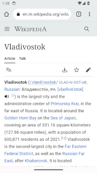

# API for gesture-based view-transitions

_Status: Early Proposal_

This is a proposal for an API enabling cross-document (same-origin) view
transitions using a gesture. It depends on concepts from [CSS View Transitions
2](https://drafts.csswg.org/css-view-transitions-2/).

The first part of this explainer proposes a minimal feature set enabling only
customization of existing OS and browser back gestures. The second part
discusses how this can be extended to more general use cases.

# Overriding User-Agent Traverse Gestures

## The Use Case

The initial step is to allow authors to override the visual UX of the
user-agent's back gesture, if one exists. Several user agents already implement
these kinds of gestures, for example:

* Mac Safari's touchpad drag to reveal a page in session history (iOS Safari
  uses a similar pattern triggered by from-edge touch drags):
<p align="center">

</p>

* Mac Chrome's chevron widget for triggering a back/forward traversal:

<p align="center">

</p>

* Android Chrome's OS-level back gesture. Back gesture can be triggered from
  either left or right edge of screen.
<p align="center">


</p>

The aim of this API is to enable customizing the _visual_ experience of these
gestures when traversing same-origin. The triggered _behavior_ of the back
action is not affected, nor does the API guarantee that the UA or OS will not
show any kind of UI (e.g. the Chrome/Android chevrons).

Here are some examples, from native apps, of the kinds of experiences we'd like
to enable on the web using this API:

* GMail's predictive-back. Shrinks the current view subtly to show what will
  happen when the action is triggered.
<p align="center">

</p>

* Photos back gesture shrinks the current photo into its thumbnail in the photo
  grid.
<p align="center">

</p>

## The proposed API

### Back/Forward Gesture Timelines

The UA will provide a built-in
[AnimationTimeline](https://drafts.csswg.org/web-animations-1/#animationtimeline),
for OS/UA back-forward gestures. Using Android's "edge-back" gesture as an
example: the timeline's currentTime represents the back-gesture's animation
progress and is at 0% initially. As a user triggers and progresses the back
gesture the UA sets currentTime based on the gesture's progress. The exact
mapping of distance to currentTime is UA-defined (and may be provided by
OS-level APIs).

One requirement on this timeline is that the UA must provide a snapping
behavior either to the timeline start or to the timeline end. i.e. If the user
releases their finger mid-way through the gesture, the UA must either play the
gesture forward to the end or reverse and play back to start. (This is how all
existing UA gestures behave).

It's important for an author to know whether a gesture comes from the left or
right edge in order to setup a matching animation (i.e. sliding content in the
correct direction). Additionally, the meaning of an edge may differ depending on
the platform: on iOS the right edge (in left-to-right languages) means forward
while on Android both edges trigger the back action. Therefore, we propose four
built-in timeline names:

  * `-ua-gesture-back-left`
  * `-ua-gesture-back-right`
  * `-ua-gesture-forward-left`
  * `-ua-gesture-forward-right`

Authors also need some way to associate animations with specific timelines. One
option is a new pseudo class that's active on the root whenever the gesture
associated with the timeline is active:

```css
:root:active-timeline('-ua-gesture-back-left') {
  ::view-transition-old(root) {
    animation: slide-right;
    animation-timeline: -ua-gesture-back-left;
  }
}
:root:active-timeline('-ua-gesture-back-right') {
  ::view-transition-old(root) {
    animation: slide-left;
    animation-timeline: -ua-gesture-back-right;
  }
}
```

### The `preemptive-trigger` descriptor

We add a new `preemptive-trigger` descriptor to the [`@view-transition`
rule](https://www.w3.org/TR/css-view-transitions-2/#view-transition-rule). This
trigger accepts a timeline name which will invoke the view-transition.
Only the new `-ua-gesture-*` timelines are initially allowed (see the [Future
Extension](#generic-gestures) section for how we expect to extend this). This
view transition is triggered when the gesture associated with the given timeline
becomes active.

```css
@view-transition {
    preemptive-trigger: -ua-gesture-back-left;
}
```

Using `-ua-gesture-back-left` in a `preemptive-trigger` will disable any UA provided
transitions (e.g. the page sliding effect in Safari); though, the UA or OS may
still draw UI such as arrows or chevrons at its discretion.

A transition triggered via `preemptive-trigger` will cause all view
transition animations to use the triggering timeline as their animation
timeline.

It's expected that gesture-based transitions will also be triggerable via
discrete actions, for example, by clicking the UI back-button. Including
`preemptive-trigger` in the `@view-transition` rule means authors can handle
both these actions using the same style:

```css
@view-transition {
    navigation: auto;
    preemptive-trigger: -ua-gesture-back-left;
    types: back-animation;
}
```

### Preemptive Snapshots

A premptively-triggered transition runs on the outgoing page. This is in
contrast to ordinary cross-document (MPA) view-transitions which run on the
incoming page. This means the transition must have an incoming snapshot
available before the incoming document is loaded.

For `-ua-gesture-back-left`, the destination is implicitly known (1 entry back
in the session history). Some UAs already take screenshots for use in
hover-previews or the default gesture back transition (e.g. [Safari back
gesture](#use-case)) which can be used in this situation.

In the future, this API would like to support snapshots from [explicitly
prerendered](https://developer.mozilla.org/en-US/docs/Web/API/Speculation_Rules_API)
pages. There may also be opportunity to snapshot pages in the [back-forward
cache](https://web.dev/articles/bfcache). See [Prerendered View
Transitions](#prerendered-view-transitions) below.

The incoming page will produce only a root snapshot. However, the outgoing page
may tag shared elements using `view-transition-name` as usual.

### Dealing with unavailable snapshots

It's impossible to guarantee the UA will have snapshots available for a page
that isn't loaded. Pages can be evicted from the BFCache or be entirely
ineligible. User agents that take screenshots might evict those screenshots
after some time or memory pressure.

In these situations, the UA will provide a default "fallback" snapshot for the
incoming page, such as a skeleton loader with a favicon.

Eventually, APIs could be added to enable authors to build "fallback" content
that can be rendered in-place of a missing preemptive snapshot. See
[Author-Controllable Fallbacks](#author-controllable-fallbacks).

### Transition Lifecycle

1. User initiates a back gesture, producing the first frame with
    `-ua-gesture-back-left`'s currentTime > 0%.
    * The view transition is triggered. A the view-transition pseudo tree is
      constructed, snapshots are taken. The UA provides an incoming root
      snapshot from the session history (via UA screenshots or BFCache).
2. User scrubs the back-gesture with their finger
    * The view-transition pseudos animations are driven by the user's finger
      movement, since the animations are associated with the
      `-ua-gesture-back-left` timeline.
3. If the user lifts their finger before the triggering threshold (i.e. the gesture
   doesn't trigger a back action).
    * The UA/OS reverses the gesture animation causing the
      `-ua-gesture-back-left` timeline's currentTime to progress towards 0%.
    * When the timeline reaches 0%, the view transition is skipped.
4. If the user lifts their finger after the triggering threshold (i.e. the
   gesture triggers a back action).
    * The UA/OS progresses the gesture animation causing the -ua-gesture-back
      timeline's currentTime to progress towards 100%.
    * The UA/OS issues a back action, causing the UA to start a navigation back
      in session history.
    * Rendering is suppressed - the UA may provide some UI to indicate loading
      and allow cancellation.
    * When the navigation commits and produces a new frame, cross-fade from the
      the last frame produced by the old page.
    
### Accessibility Considerations

#### Non-gestural navigation

Not all users are able to naturally gesture on a screen, care must be taken to
ensure the API does not restrict navigations to only be triggerable via
gestures. The API shape should encourage gestures as a supplement to traditional
links, rather than a replacement.

At a minimum, all gesture-triggered navigations must be exposed to assistive
technologies so they can be triggered in other ways.

The [API described above](#api-proposal) does not have this issue since it
makes use of the UA/OS back gesture which is already accessible. However, this
is a major consideration for [future directions](#future-extension) where authors
may define their own gestures to navigate to arbitrary destinations.

#### Motion

Some users may experience discomfort in response to large animated motions on a
page. It should be possible for these users to have an option to navigate
without animations, or with significantly reduced motion.

CSS already defines the [prefers-reduced-motion](https://developer.mozilla.org/en-US/docs/Web/CSS/@media/prefers-reduced-motion)
media query for this purpose. The API must make it easy for authors to take this
preference into account as part of its design.

### Privacy and Security

Like ordinary view transitions, gesture-based transitions are limited to
same-origin navigations. With that restriction we don't anticipate there being
significant new implications distinct from view transitions more generally.

# Future Extension

There are a few ways we anticipate this work evolving which is influencing the
design of the history-gesture-based API.

## Generic Gestures

That is, authors may want to trigger view transitions with gestures other than
a built-in OS or UA-level navigational gesture.

For example: flinging a photo up to send it back to a grid-view. Or swiping a
carousel to the next item.

Today, authors can implement this kind of behavior using event-driven APIs in
JavaScript. Longer term, we think the right direction is a timeline-based
approach, where user input drives a CSS timeline, akin to Scroll or View
Timelines, which can be used to interface with features like gesture-driven
view transitions.

Without getting into the details of the gesture itself, the main idea for
gesture-VT would be to associate a gesture both with a navigation action as
well as a view transition, for example:

```html
<a href="next-page.html" triggeringGesture="--swipe-next-timeline">
  Next Page
</a>
```

Would associate the the `--swipe-next-timeline` driving gesture with a
navigation to `next-page.html`. When the gesture "completes" (glossing over a
lot here), the navigation is initiated as-if the `<a>` were clicked.

To associate the gesture with the view transition, authors can use the
`preemptive-trigger` descriptor.

```css
@view-transition {
  navigation: none;
  preemptive-trigger: --swipe-next-timeline;
  types: nextpage;
}
```

When the gesture becomes active, the `preemptive-trigger` invokes the view
transition which can tell that the gesture will navigate to `next-page.html`
and thus can grab snapshots from an active
[prerender](#prerendered-view-transitions), for example.

## Gesture Timelines

To be usable with a triggering gesture, an animation timeline must have some
notion of thresholds and snap-points (akin to scroll snap points). Using the
Android back gesture to help explain:

When the user starts dragging from the screen edge the back gesture begins. If
the user lifts their finger while it's still close to the edge, the animating
UI will "rewind" back to where it started and the back-action is aborted. That
is, the "0% progress" part of the gesture is a kind of "snap-point". The
gesture-driven animation can end there.

Similarly, if the user drags far away from the edge, past a certain
"threshold", and then releases, the back-action is invoked. The animation may
play (or reverse) to a different snap point.

We could say this back-gesture has two snap-points: one for abort and one for
invoke. It also has a threshold at which the gesture will independently animate
to one point or the other, when the user releases.

In the case of the proposed `-ua-gesture-back-*` timelines, the UA/OS already
provides this behavior implicitly. For generic gesturing, authors will need to
be able to describe similar behaviors for their custom timelines.

## Prerendered View Transitions

If a user can gesture to perform a view transition to a new page, the API must
be able to show something before the page has been loaded. Chrome already has
[support for prerendering](https://developer.mozilla.org/en-US/docs/Web/API/Speculation_Rules_API)
pages - when a UA supports the speculation rules API, a preemptively triggered
view transition can grab snapshots from the prerendered page.

Similarly, some user agents have support for keeping documents alive - though
frozen - in a "back-forward cache". It's plausible that user agents might be
able to take snapshots from documents in this state.

More investigation is needed in both these cases on exactly how this would work.

## Author-Controllable Fallbacks

A "fallback" is static content that's shown when there's no live page available
to snapshot. A simple fallback could be provided by a UA to simply show a
generic loader page with a favicon matching the current page.

However, an author would be able to create a fallback which blends more
naturally with their app. We'd like to eventually provide an ability to build
content, using HTML and CSS, that can be snapshotted by a view transition for
use as an incoming-page fallback.


