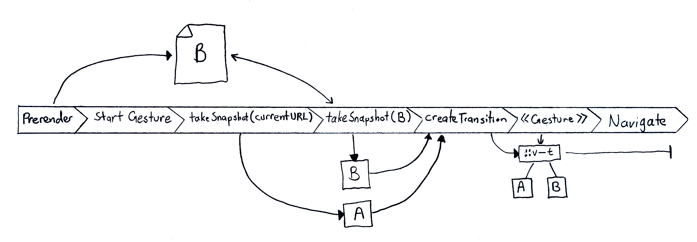

# Gesture-Driven View Transitions

This explainer explores the additions required to enable web authors to use view
transitions in gesture-based transitions.

## Gesture Based Transition

View transitions enabled smoothly interpolating between two views of a web app,
both within a single document (“single page apps” - SPAs) and across documents
(“multi page apps” - MPAs). However, the typical use case for these APIs was a
discrete action: the user clicks or taps a button which triggers a view
transition animation; a common interaction pattern on native (and on the web) is
for transitions to be gesture-driven, allowing the user to control the
animation. This allows a user to peek at the next view and make a decision about
whether to transition to it or reverse the gesture and abort the transition.

## Example Use Cases:

#### Predictive Back Navigation

<!--
#### Infinite carousels
TODO
-->

#### Tab switchers

## In SPAs

Several proof of concepts show that a single-page app can already use gestures
to drive a view transition. [This demo](https://simple-set-demos.glitch.me/gesture/)
from Jake Archibald, or the [music playlist demo](https://twitter.com/bramus/status/1749461824817311947)
from Bramus Van Damme are two good examples. Since this is already possible in
SPA, this proposal is mainly concerned with how to expose this same capability
to cross-document (MPA) transitions. However, a solution for MPA would ideally
be usable in SPA transitions, to make those easier to build and maintain
consistency across the two types.

## Missing Pieces

In a typical MPA view transition, the order of events is:

1. Capture snapshot of outgoing page
2. Navigate to incoming page - preventing a new frame from being rendered (holding the rendered outgoing page)
3. (Once incoming page is ready to render) capture snapshot of incoming page
4. Create a view transition and play it

This is a “transition-after-update” model -  the transition animation occurs on
the incoming page, after the navigation has updated the app’s state. 

However, for a transition to be gesture-driven, the input stream must start on
the outgoing page. Assuming we could use a continuous gesture stream across
document navigations - consider an ordinary MPA view transition on an app that
uses a back swipe to reveal the previous page in the session history. The moment
a user starts a drag, the current view is unloaded and replaced by a static
snapshot. Videos and animations stop playing and any unpersisted state (focus?
Scroll offsets? Form data? etc) is lost. The user has technically already
navigated back in history. If they change their mind and abort the gesture (i.e.
release the gesture intending to stay on the original view), the original
document has to be (potentially) reloaded. This is a bad UX and not how gesture
transitions typically work in native apps and SPAs.

**The first missing piece for gesture navigations is an MPA model with
“transition-before-update” - the transition must run on the outgoing page**. This
implies the ability to provide the View Transitions API with snapshots from a
non-active document (e.g. from BFCache, or from a prerender).  

In a gesture transition, the app has to respond immediately to the user. But the
next view may not be in a BFCache or Prerender. The transition must be able to
start without waiting on a network fetch and load. This leads to **the second
missing piece: the ability to provide “fallback” content for View Transitions to
use, if the primary snapshot isn’t immediately available**. Some ideas on
potential solutions:

* Specify an invisible subtree of the outgoing DOM as a fallback snapshot. An
  author can build a “[skeleton loader](https://m3.material.io/styles/motion/transitions/transition-patterns#f7ff608a-087d-4a4e-9e83-f1af69184487)”
  on the outgoing page and take a snapshot of it. If the prerender isn’t
  available at gesture start time, the view transition will start with the
  skeleton snapshot.
* Multiple browsers take screenshots of pages for use in
  predictive-history-back navigations or to show as previews in their UI. For a
  back navigation where the page isn’t in the BFCache but the browser has these
  screenshots available, the screenshot can be used instead.
* Authors could use a canvas to render their own fallback snapshots.
* Allow specifying an image resource (though this also has potential to be unavailable
  due to network fetch delays)

